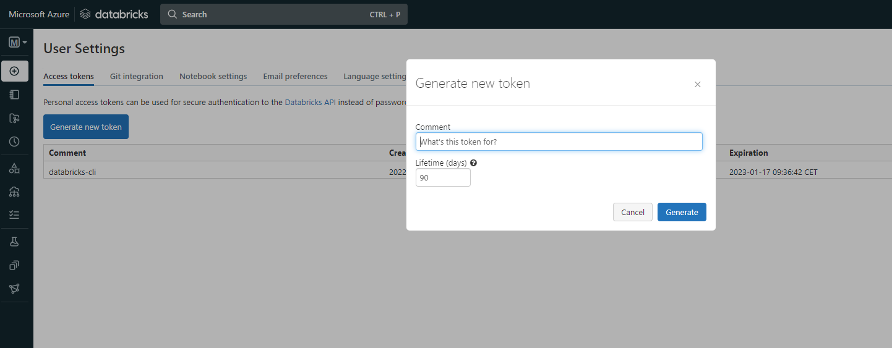

# databricks-dbx
This simple repo show the basic usage of [dbx by Databricks Labs](https://dbx.readthedocs.io/en/latest/) for Databrick's job authoring and submission using VS Code as IDE.

>Note: Is serves for Spark job submission only.

Code coming from: https://learn.microsoft.com/en-us/azure/databricks/dev-tools/ide-how-to

## Setup
For complete prerequisities use link to documentation above.

>Note: you can benefit from GitHub Codespaces.

Install necessary packages

```
pip install dbx
pip install databricks-cli
```

Login to Azure
```
az login --tenant 9fe3aa9b-55d5-419c-9e8d-9287463a11c6 --use-device-code

```
### Configure Databricks CLI
use [Databricks PAT](https://learn.microsoft.com/en-us/azure/databricks/dev-tools/api/latest/authentication) (can be Azure AAD token)


```
databricks configure --host https://adb-895466096186416.16.azuredatabricks.net --token
```

validate

`cat ~/.databrickscfg`

## Clone sample code

```
git clone https://github.com/databricks/ide-best-practices
```

### Install packages and run definitions
```
cd ide-best-practices
pip install -r unit-requirements.txt
pip install -e .

pytest tests/
```

### Modify deployment
change `deployment.yml` to use Azure VMs: `Standard_DS3_v2`

## Deploy your jobs to Databricks Workspace
send the dbx project’s contents to your Azure Databricks workspace
```
dbx deploy --environment=default
```
Output:


you can see depoyed job in Workflows UI:


## Run/Start the job
Run the pre-production version of the code in your workspace:
```
dbx launch covid_analysis_etl_integ
```

Output:


You shoud see new Job cluster created and running:


